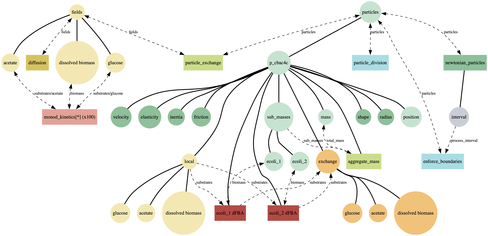

# Spatio-Flux: Compositional Multiscale Simulation with Process Bigraphs

**Spatio-Flux** is a reference application for **compositional multiscale biological modeling** built using the **Process-Bigraph** framework. It demonstrates how independently developed models—metabolism, spatial transport, particle dynamics, and population restructuring—can be composed into a single executable simulation through **typed interfaces and shared orchestration**, rather than tightly coupled solvers.

Spatio-Flux serves as the primary worked example in  
*Process Bigraphs and the Architecture of Compositional Systems Biology* (Agmon & Spangler).

---

## What it demonstrates

Spatio-Flux shows how to:
- compose heterogeneous modeling paradigms (ODEs, dFBA, spatial fields, particles),
- couple processes through shared, typed state instead of direct calls,
- coordinate multi-timescale execution using reusable orchestration patterns,
- swap or recombine mechanisms without modifying surrounding models.

It is designed as a **testbed and reference implementation**, not as an optimized domain-specific simulator.

---

## Reference composite

The figure below shows a representative “mega-composite” simulation integrating:
metabolic processes, spatial diffusion, particle motion, particle–field exchange, and
event-driven population restructuring into a single process bigraph.

---

## Example simulation (animated)

The animation below shows a reference simulation where motile particles carrying internal
metabolic models interact with evolving spatial nutrient fields.

---

## Automated examples

Spatio-Flux includes an automated test suite covering:
- Monod and dynamic FBA metabolism
- Hybrid microbial communities
- COMETS-style spatial dFBA
- Brownian and Newtonian particle systems
- Particle–field coupling
- Event-driven division and boundary handling

**Live test report:**  
👉 https://vivarium-collective.github.io/spatio-flux/report/index.html

---

## Ecosystem

Spatio-Flux is part of **Vivarium 2.0**:
- `bigraph-schema` — compositional type schemas
- `process-bigraph` — process and composite simulation interfaces
- `bigraph-viz` — visualization tool for bigraph schema
- `spatio-flux` — reference multiscale application

All components are open-source:  
https://github.com/vivarium-collective
