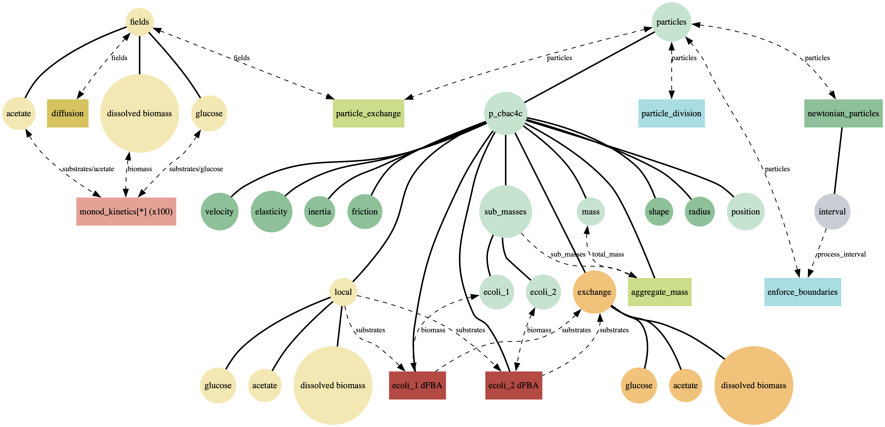

# Spatio-Flux

[](https://vivarium-collective.github.io/spatio-flux/report/index.html)
[](https://arxiv.org/abs/2512.23754)
[](https://github.com/vivarium-collective)

A reference application for **compositional multiscale biological modeling** built on the
[Process-Bigraph](https://github.com/vivarium-collective/process-bigraph) framework.
Spatio-Flux composes independently developed processes — metabolism, spatial transport,
particle dynamics, structural rewrites — into a single executable simulation via typed
interfaces and shared orchestration, not tightly coupled solvers.

It's the worked example in *Process Bigraphs and the Architecture of Compositional
Systems Biology* (Agmon & Spangler, [arXiv:2512.23754](https://arxiv.org/abs/2512.23754)).

> ▶ **[Browse the live test suite report →](https://vivarium-collective.github.io/spatio-flux/report/index.html)**
> 19 composite scenarios, each with structure diagrams, time series, and plots.




---

## What this repo is

Spatio-Flux is a **testbed and reference implementation**, not an optimized domain
simulator. Its purpose is to make model composition explicit and inspectable.

It demonstrates how to:
- compose heterogeneous modeling paradigms (ODEs, dFBA, spatial fields, particles)
- couple mechanisms through shared typed state, not direct process calls
- coordinate multi-timescale execution with reusable orchestration patterns
- swap or recombine processes without modifying surrounding models

---

## The test suite

The heart of the repo is `spatio_flux/experiments/test_suite.py`, which exercises 19
composition patterns and renders the report linked above.

Covered scenarios include:
- Monod and dynamic FBA metabolism (single-strain + multi-strain communities)
- COMETS-style spatial dFBA on a lattice
- Brownian and Newtonian (Pymunk) particle systems
- Particle–field exchange with embedded metabolism
- Event-driven division and boundary handling

Each scenario produces a process-bigraph diagram, serialized schemas and state, and
domain-specific plots or animations.

Each composite is a `@composite_generator`-decorated function under
`spatio_flux/composites/`, discoverable by the
[pbg-superpowers](https://github.com/vivarium-collective/pbg-superpowers) dashboard.

---

## Run it locally

```bash
git clone https://github.com/vivarium-collective/spatio-flux.git
cd spatio-flux
uv sync
uv run python spatio_flux/experiments/test_suite.py --output out
open out/report.html
```

`--tests <name1> <name2> …` runs a subset. `--skip-existing` reuses cached per-test
artifacts so you can re-render the HTML without re-simulating.

---

## Ecosystem

Spatio-Flux is part of **Vivarium 2.0** — an open-source ecosystem for compositional modeling:

- [bigraph-schema](https://github.com/vivarium-collective/bigraph-schema) — typed hierarchical schemas
- [process-bigraph](https://github.com/vivarium-collective/process-bigraph) — process and composite simulation interfaces
- [bigraph-viz](https://github.com/vivarium-collective/bigraph-viz) — visualization of bigraph structure and data flow
- [pbg-superpowers](https://github.com/vivarium-collective/pbg-superpowers) — convention + dashboard for discoverable composites
- [spatio-flux](https://github.com/vivarium-collective/spatio-flux) — reference multiscale application (this repo)

## Citation

```bibtex
@article{agmon2025spatioflux,
  title  = {Process Bigraphs and the Architecture of Compositional Systems Biology},
  author = {Agmon, Eran and Spangler, Daniel},
  journal = {arXiv preprint arXiv:2512.23754},
  year   = {2025},
}
```
